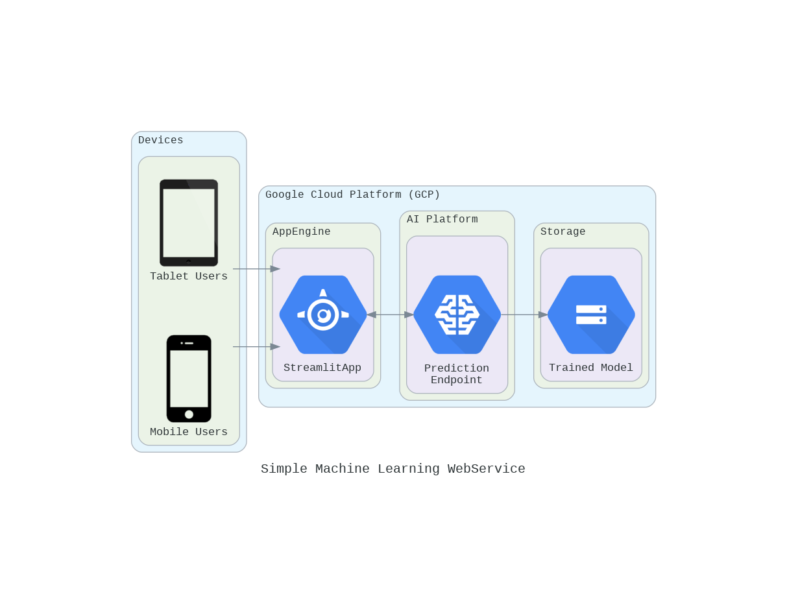

# Simple Machine Learning Webservice Deployed on GCP

## The architecture

<!--add an image in this path-->

<!--Optionally, add flow steps based on the architecture diagram-->
## Flow

1. User visits the webapp, enter trip details and hit `predict`

2. Trip details are formatted and sent to the prediction endpoint.

3. Prediction endpoint uses the trained model stored in Cloud Storage to make prediction.

4. The prediction is displayed to the user.

<!--## Demo-->
<!--add a gif of webapp-->

## Getting started

See [SETUP.md](SETUP.md)

## Dataset
- [Taxi Data](https://www.mathworks.com/supportfiles/practicaldsmatlab/taxi/Taxi%20Data.zip) - Two percent of the total trips sampled at random from each month of 2015.
- [Full Dataset](https://www1.nyc.gov/site/tlc/about/tlc-trip-record-data.page) - 12 years (2009 –2020) worth of Data available

## Library used
- geopy
- google-api-python-client
- joblib
- streamlit
- streamlit-folium
- scikit-learn
- python-dotenv

## Acknowledgements
- Coursera Courses
  - [IBM Machine Learning Professional Certificate](https://www.coursera.org/professional-certificates/ibm-machine-learning)
  - [Practical Data Science with MATLAB Specialization](https://www.coursera.org/specializations/practical-data-science-matlab)