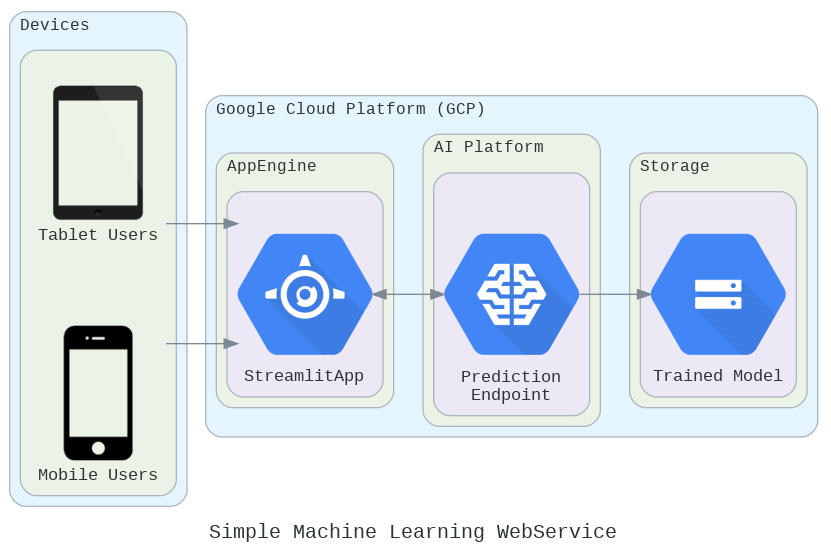

# Simple Machine Learning Webservice Deployed on GCP

## Setup

1. Install `pip` and `virtualenv` if you do not already have them.

2. Clone this repository:

    ```
    git clone https://github.com/kenextra/IBM-MLCert.git
    ```

## How to run locally

1. Change directory to `Project` folder:

    ```
    cd Project/
    ```

2. Create a virtualenv. These are compatible with Python 3.6+.

    ```
    python3 -m venv env
    source env/bin/activate
    ```
    *For windows*
    ```
    python -m venv env
    env\Scripts\activate
    ```

3. Install the dependencies needed to run the app.

    ```
    pip install -r requirements.txt
    ```

4. Run the app:

    ```
    streamlit run app.py
    ```

## How to host on GCP

###  The architecture

<!--add an image in this path-->


*[Check here](https://cloud.google.com/appengine/docs/flexible/custom-runtimes/build)*
