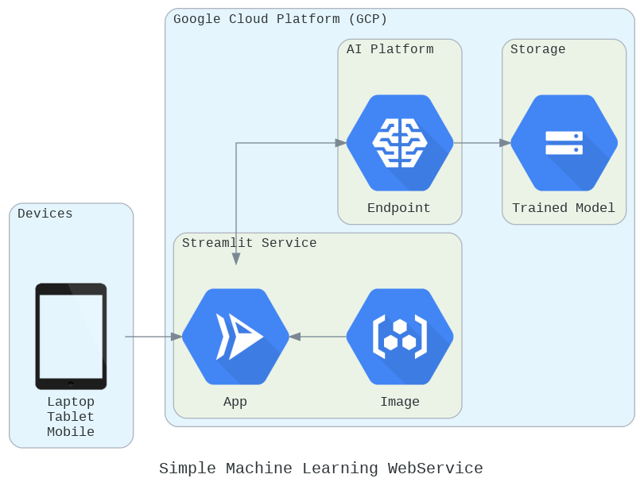

# Simple Machine Learning Webservice on GCP

## Folder Structure
```bash
.
├── LICENSE
├── Notebooks
│   ├── Course Reports
│   │   ├── Deep Learning and Reinforcement Learning.pdf
│   │   ├── Exploratory Data Analysis for Machine Learning.pdf
│   │   ├── Specialized Models Time Series and Survival Analysis.pdf
│   │   ├── Supervised Machine Learning Classification.pdf
│   │   ├── Supervised Machine Learning Regression.pdf
│   │   └── Unsupervised Machine Learning.pdf
│   ├── Deep_Learning_and_Reinforcement_Learning.ipynb
│   ├── Exploratory_Data_Analysis_for_Machine_Learning.ipynb
│   ├── README.md
│   ├── Specialized_Models_Time_Series_and_Survival_Analysis.ipynb
│   ├── Supervised_Machine_Learning_Classification.ipynb
│   ├── Supervised_Machine_Learning_Regression.ipynb
│   ├── Unsupervised_Machine_Learning.ipynb
│   ├── colorsetup.py
│   ├── import_dataset.py
│   ├── pickupLocations.csv
│   └── taxiPickups.csv
├── Project
│   ├── Build_Model.ipynb
│   ├── Dockerfile
│   ├── README.md
│   ├── SETUP.md
│   ├── ai_platform_command.txt
│   ├── app.py
│   ├── app.yaml
│   ├── cloudrun.txt
│   ├── helper.py
│   ├── import_dataset.py
│   ├── main.py
│   ├── model.joblib
│   ├── requirements-test.txt
│   └── requirements.txt
├── README.md
├── Webservice_Deploy_Diagram.ipynb
├── images
│   ├── CloudRunStreamlit.png
│   ├── streamlit.png
│   ├── streamlit4.png
│   └── webapp.PNG
└── requirements.txt
```
### Notebooks
Please open [Notebooks](Notebooks/README.md) for jupyter notebooks used for the coursera courses.

### Project
See [Project](Project/README.md) for details on how to run locally or in GCP

## The architecture

<!--add an image in this path-->


<!--Optionally, add flow steps based on the architecture diagram-->
## Flow

1. User visits the webapp, enter trip details and hit `predict`

2. Trip details are formatted and sent to the prediction endpoint.

3. Prediction endpoint uses the trained model stored in Cloud Storage to make prediction.

4. The prediction is displayed to the user.

## Demo
<!--add a gif of webapp-->

## Dataset
- [Taxi Data](https://www.mathworks.com/supportfiles/practicaldsmatlab/taxi/Taxi%20Data.zip) - Two percent of the total trips sampled at random from each month of 2015.
- [Full Dataset](https://www1.nyc.gov/site/tlc/about/tlc-trip-record-data.page) - 12 years (2009 –2020) worth of Data available

## Library used
- geopy
- google-api-python-client
- joblib
- streamlit
- streamlit-folium
- scikit-learn
- python-dotenv

## Acknowledgements
- Coursera Courses
  1. [IBM Machine Learning Professional Certificate](https://www.coursera.org/professional-certificates/ibm-machine-learning)
  2. [Practical Data Science with MATLAB Specialization](https://www.coursera.org/specializations/practical-data-science-matlab)
